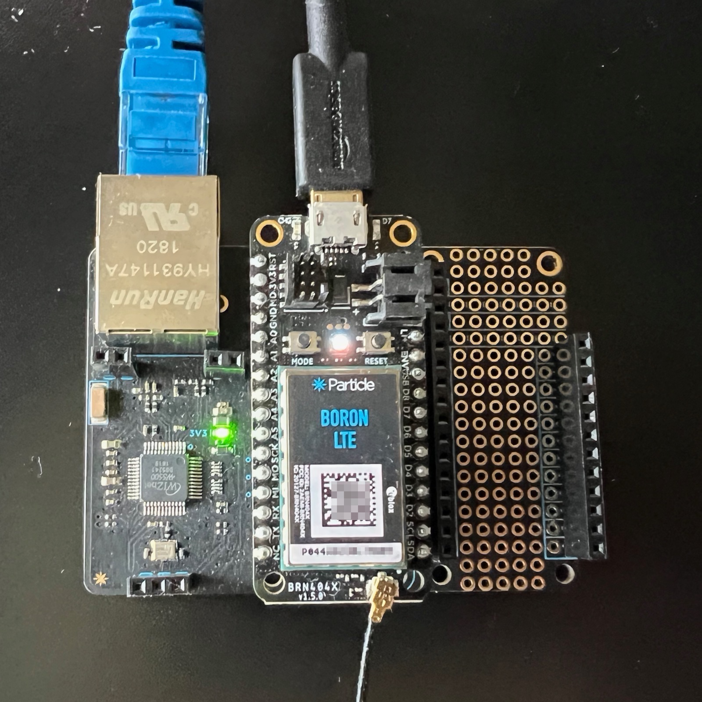
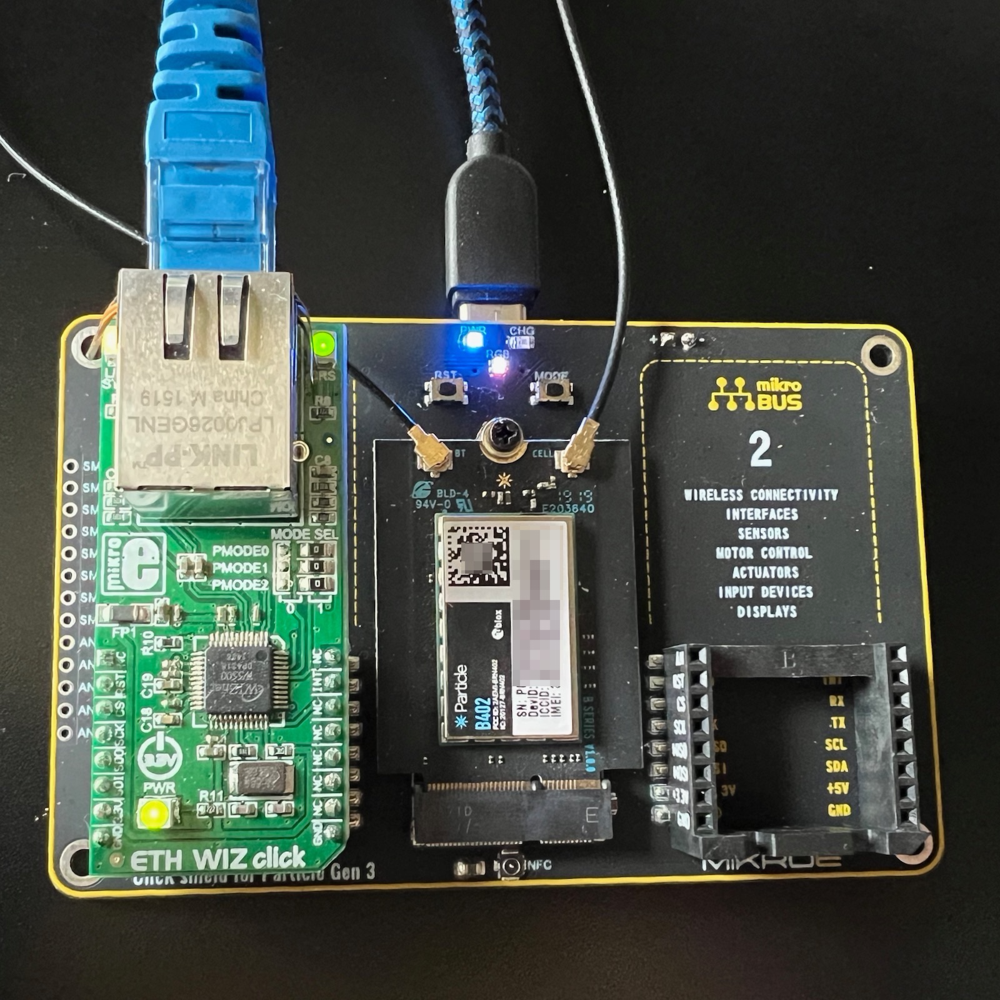

# IsolatedEthernet

**Particle library for WIZnet W5500 for accessing devices on isolated Ethernet LANs**

- Github: https://github.com/particle-iot/IsolatedEthernet
- [Full browseable API documentation](https://particle-iot.github.io/IsolatedEthernet/class_isolated_ethernet.html)
- License: Apache 2.0 (can use in open or closed source projects, including commercial projects, for free)


Features:

- Only implements TCPClient, TCPServer, UDP, and UDP multicast to Ethernet. Cloud connection uses native networking (cellular or Wi-Fi).
- Static IP addressing or DHCP.
- Can connect to an isolated Ethernet network. There is no IP routing between networks so the isolated network stays isolated.
- Works with any available SPI interface and any available GPIO for SPI CS. INT and RESET are optional.
- Uses separate TCPClient, TCPServer, and UDP classes over Ethernet so you can still use those classes with native networking at the same time.
- Works with any WIZnet W5500 board, including Particle M.2 evaluation board, Ethernet FeatherWing, Mikroe ETH click, and Adafruit Ethernet FeatherWing.
- Works on Gen 3 devices (Boron, B Series SoM, Argon, Tracker SoM).
- Does not currently work on the P2 or Photon 2, but is expected to in the future.
- Will not work on Gen 2 (E Series, Electron, Photon, P1) or the Tracker One (does not have SPI exposed).
- Can store static IP information in the file system. Example code to set it using a Particle.function remotely.

While the WIZnet W5500 works on isolated networks, and with static IP addressing, it may not completely work in situations where there is no router or gateway on the Ethernet LAN at all. The W5500 is able to send UDP and UDP multicast in this scenario, but other hosts may not be able to send data to it, thus making it impossible to receive data or use TCP connections (client or server). Note that a gateway does not have to connect to any other network, it just needs to be there as the default to route between hosts on the same LAN. This may be dependent on what the other side of the connection is, as well.

If you are setting up a point-to-point Ethernet between two hosts, also note that the WIZnet W5500 does not support Auto-MDIX so if the other side does not support it, you will need to use an Ethernet crossover cable. 

This library is not intended for high speed bulk uploads of things like video files. Gen 3 devices don't generally have enough internal storage, RAM, or CPU to handle that anyway, but the upload (to a server on the Ethernet LAN) speed is around 950 Kbytes/sec and the download speed is around 100 Kbytes/sec. Of course this is still significantly faster than cellular.

## Setup

The library lives completely separate from the Device OS Ethernet implementation, and in fact you must disable Ethernet in Device OS for proper operation.

```cpp
// Ethernet must be disabled in Device OS. Include this in setup()
System.disableFeature(FEATURE_ETHERNET_DETECTION);
```

There are also other methods you must call from setup(), depending on the hardware and software configuration you want to use.

## Hardware

This library should work with any WIZnet W5500 module. Some options include:

### Particle Ethernet FeatherWing



The [Particle Ethernet FeatherWing](https://docs.particle.io/reference/datasheets/accessories/gen3-accessories/#ethernet-featherwing) can be used with this library.

```cpp
// PROTOTYPE
IsolatedEthernet &withEthernetFeatherWing() 

// EXAMPLE - use in setup()
IsolatedEthernet::instance()
    .withEthernetFeatherWing()
    .setup();
```

### Particle M.2 SoM evaluation board

The [Particle M.2 SoM evaluation board](https://docs.particle.io/reference/datasheets/b-series/b-series-eval-board/) can be used with this library.

```cpp
// PROTOTYPE
IsolatedEthernet &withEthernetM2EvalBoard()

// EXAMPLE - use in setup()
IsolatedEthernet::instance()
    .withEthernetM2EvalBoard()
    .setup();
```


### Mikroe ETH click

The [Mikroe ETH WIZ click](https://www.mikroe.com/eth-wiz-click) contains a W5500 and can be used on their click shield boards.

For more information, see the [Mikroe community page](https://docs.particle.io/hardware/expansion/mikroe/) in the docs.



In this picture, it's used with the [Gen 3 SoM click shield](https://www.mikroe.com/click-shield-for-particle-gen-3). There are two sockets in most click shield base boards, and the bus parameter specifies which one you have the Ethernet installed in (1 = left, 2 = right).

```cpp
// PROTOTYPE
IsolatedEthernet &withEthernetMikroeGen3SomShield(int bus);

// EXAMPLE - use in setup()
IsolatedEthernet::instance()
    .withEthernetMikroeGen3SomShield(1)
    .setup();
```

There is also a [Feather click shield](https://www.mikroe.com/feather-click-shield) that can be used with the Boron.

```cpp
// PROTOTYPE
IsolatedEthernet &withEthernetMikroeFeatherShield(int bus);

// EXAMPLE - use in setup()
IsolatedEthernet::instance()
    .withEthernetMikroeFeatherShield(1)
    .setup();
```


### Adafruit Ethernet FeatherWing

```cpp
// EXAMPLE - use in setup()
IsolatedEthernet::instance()
    .withPinCS(D5)
    .setup();
```

The [Adafruit Ethernet FeatherWing](https://www.adafruit.com/product/3201) can be used with this library. By default, it connects CS to pin D5 and does not connect INT and RESET, however these are not needed by this library.


## IP address

The IP address can be configured a number of ways.

### DHCP IP address

If the Ethernet LAN has a DHCP server, that is the easiest and does not require any configuration, and it's the default.

The DHCP server will provide the IP address, subnet mask, gateway address, and DNS server (if available).

Even if static IP addresses are assigned, it's also common to assign them in the router, based on the Ethernet MAC address. That allows the network administrator to manage the IP addresses easily, and eliminates the need to manually configure IP addresses in individual devices. Each device will use DHCP, but the router will hand out the IP address based on the Ethernet MAC, or deny access if the device is unknown.

### Static IP address

In some isolated LANs in particular there may by no DHCP server, in which case static IP addresses are required. 

You can configure the IP address in code. This is fine if each device has its own firmware, but is hard to scale. See example 4-static for a complete example of this technique.

```cpp
// EXAMPLE - use in setup()
IsolatedEthernet::instance()
    .withEthernetFeatherWing()
    .withIPAddress(IPAddress(192, 168, 2, 26))
    .withSubnetMask(IPAddress(255, 255, 255, 0))
    .withGatewayAddress(IPAddress(192, 168, 2, 1))
    .withDNSAddress(IPAddress(8, 8, 8, 8))
    .setup();    
```


### Static IP address with cloud configuration

It's also possible to store the IP address information in a file in the flash file system. You can then update this file using the Particle cloud by the native network interface, such as cellular. See example 3-static-config for a complete example of using this technique.

```cpp
// EXAMPLE - use in setup()
IsolatedEthernet::instance()
    .withEthernetFeatherWing()
    .withStaticIP()
    .withJsonConfigFile("/usr/ethercfg")
    .setup();
```

### Updating code and libraries

You must change code that uses the `TCPClient`, `TCPServer`, or `UDP` classes. Fortunately, the API is compatible and it should be a simple search and replace:

| Before | After |
| :--- | :--- |
| `TCPClient` | `IsolatedEthernet::TCPClient` |
| `TCPServer` | `IsolatedEthernet::TCPServer` |
| `UDP` | `IsolatedEthernet::UDP` |

Basically, you just need to choose by the class name whether you want to use the native Device OS implementation, or the Ethernet implementation.


### Modifying libraries in Workbench

We highly recommend using Particle Workbench for development. This is especially true if you need to modify a version of an existing community library.

If you use the **Particle: Install Library** option the library will be added to the lib directory as well as your project.properties file. With this, you can view the library source easily by navigating into the lib directory.

However, if you are going to make modifications to the library it is highly recommended that you **remove the library from project.properties!**

This is necessary because cloud compiles will use the official version in the community libraries if present in project.properties, even though your modified version is uploaded. Local compiles will use your modified version regardless of the project.properties files, but it's a good habit to remove the line to prevent confusion later.

Committing your modified project to a source control system like Github will make sure not only your code remains safe, but also your modified community libraries.

## Logging

Normally you'd enable logging like this:

```cpp
SerialLogHandler logHandler(LOG_LEVEL_INFO);
```

Logging within the library uses a logging category of app.ether, so you can set the log level independently. For example, if you want additional debugging messages, you can set it to:

```cpp
SerialLogHandler logHandler(LOG_LEVEL_INFO, { // Logging level default
    { "app.ether", LOG_LEVEL_TRACE } // Logging level for IsolatedEthernet messages
});
```


## Additional information


- [WIZnet W5500 documentation](https://www.wiznet.io/product-item/w5500/)
- [WIZnet ioLibrary driver](https://github.com/Wiznet/ioLibrary_Driver)


## License

- This library is Apache 2.0 licensed, see LICENSE file.
- Can be used in open or closed source projects.

### WIZnet

Copyright (c) 2014 WIZnet Co.,Ltd.
Copyright (c) WIZnet ioLibrary Project.
All rights reserved.

Permission is hereby granted, free of charge, to any person obtaining a copy
of this software and associated documentation files (the "Software"), to deal
in the Software without restriction, including without limitation the rights
to use, copy, modify, merge, publish, distribute, sublicense, and/or sell
copies of the Software, and to permit persons to whom the Software is
furnished to do so, subject to the following conditions:

The above copyright notice and this permission notice shall be included in all
copies or substantial portions of the Software.

THE SOFTWARE IS PROVIDED "AS IS", WITHOUT WARRANTY OF ANY KIND, EXPRESS OR
IMPLIED, INCLUDING BUT NOT LIMITED TO THE WARRANTIES OF MERCHANTABILITY,
FITNESS FOR A PARTICULAR PURPOSE AND NONINFRINGEMENT. IN NO EVENT SHALL THE
AUTHORS OR COPYRIGHT HOLDERS BE LIABLE FOR ANY CLAIM, DAMAGES OR OTHER
LIABILITY, WHETHER IN AN ACTION OF CONTRACT, TORT OR OTHERWISE, ARISING FROM,
OUT OF OR IN CONNECTION WITH THE SOFTWARE OR THE USE OR OTHER DEALINGS IN THE
SOFTWARE.
